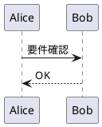
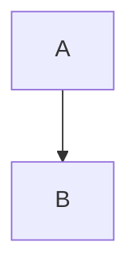

# 提案書

## 概要
業務効率化のためのツール導入をご提案いたします。

## フロー図

## ✅ 出力結果
- `proposal.pdf` に PlantUML図が画像として埋め込まれて出力されます！

---

## 表について

| ヘッダ1 | ヘッダ2 |
| ------- | ------- |
| データ1 | データ2 |
| データ1 | データ2 |
| データ1 | データ2 |

## 今後のステップについて

## ✨ 拡張案(次のステップ)

- Mermaid対応(画像化して同様に埋め込む)
- Jinja2テンプレートで複数Markdown部品を構成
- ロゴや日付、フッター追加
- MarkdownからToC(目次)生成

---

気に入れば、この構成でCLIツール化やGUI化もできます。  
次に進めるなら「Mermaid対応」や「図のキャッシュ保存」などどうしますか？

